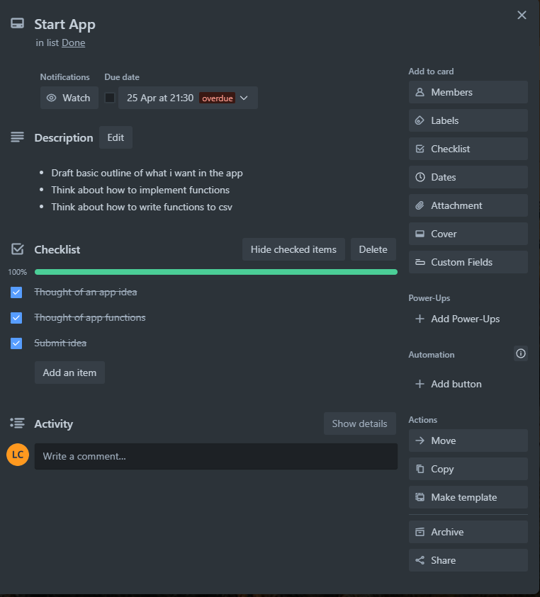
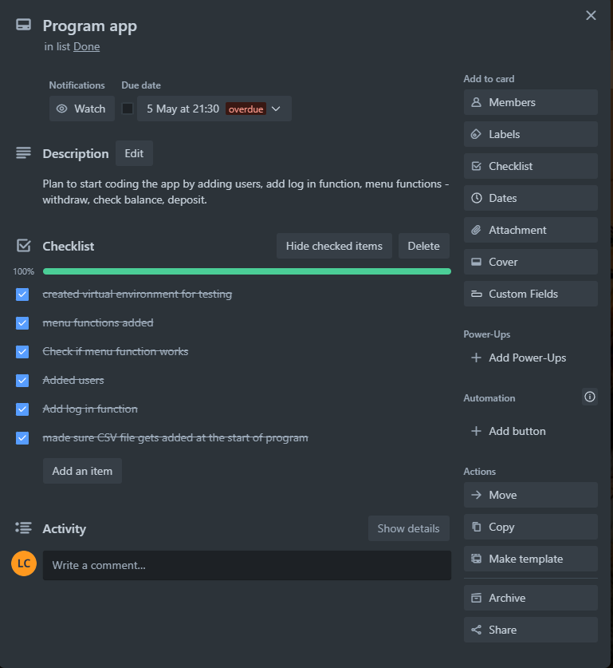
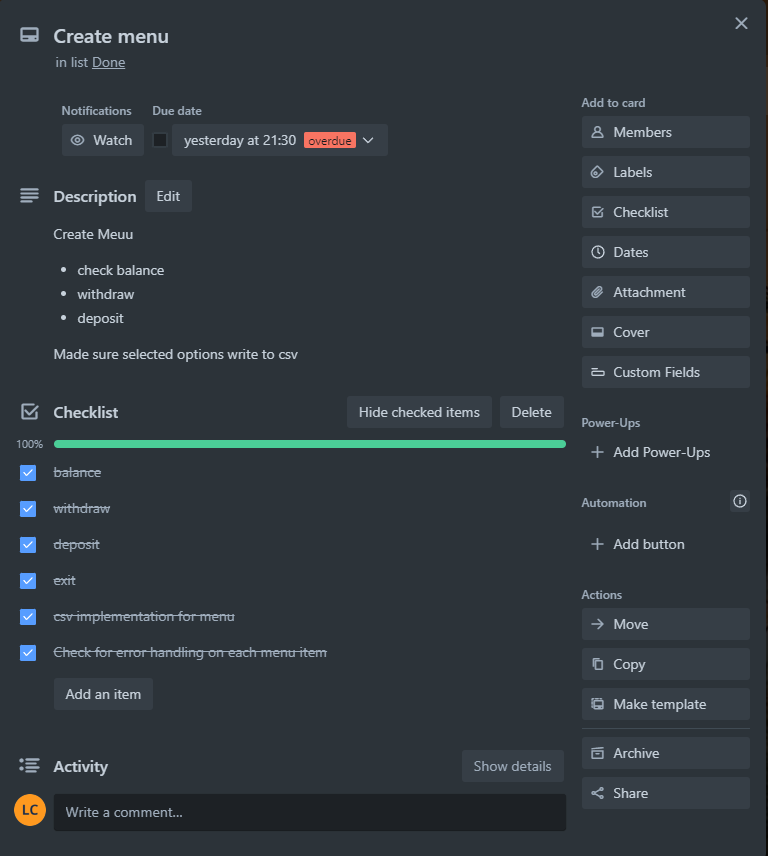
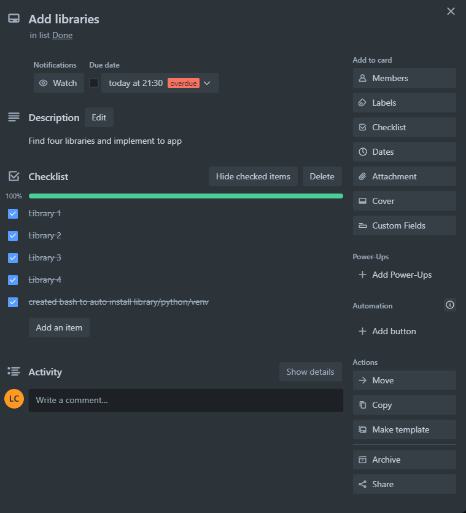
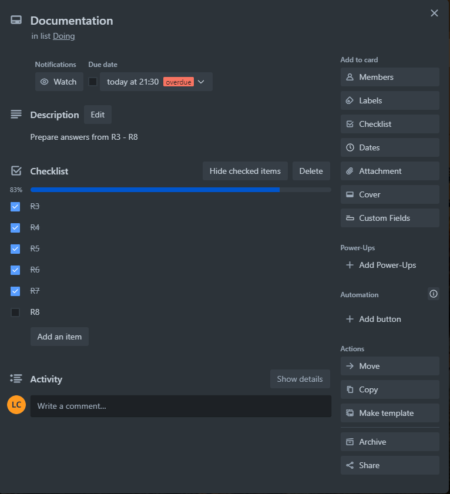
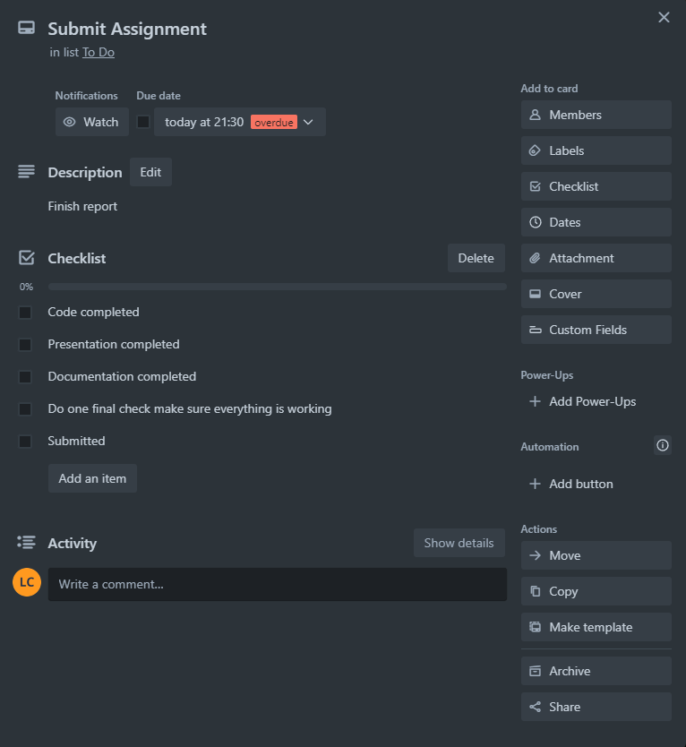
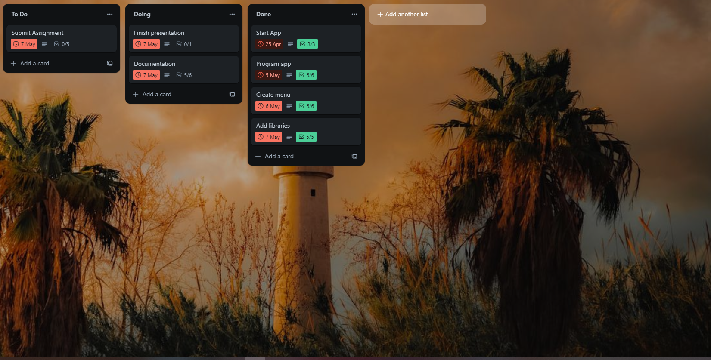
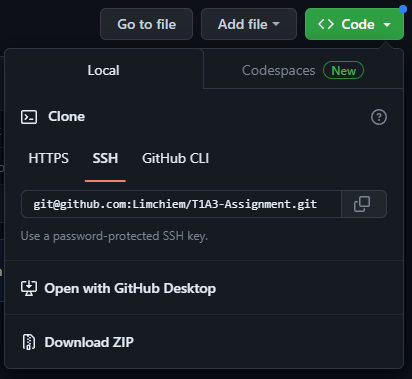
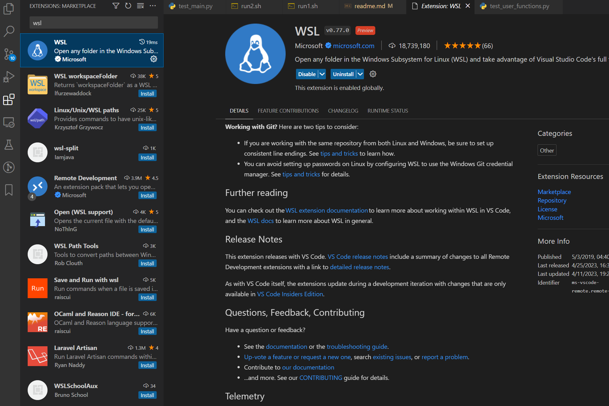
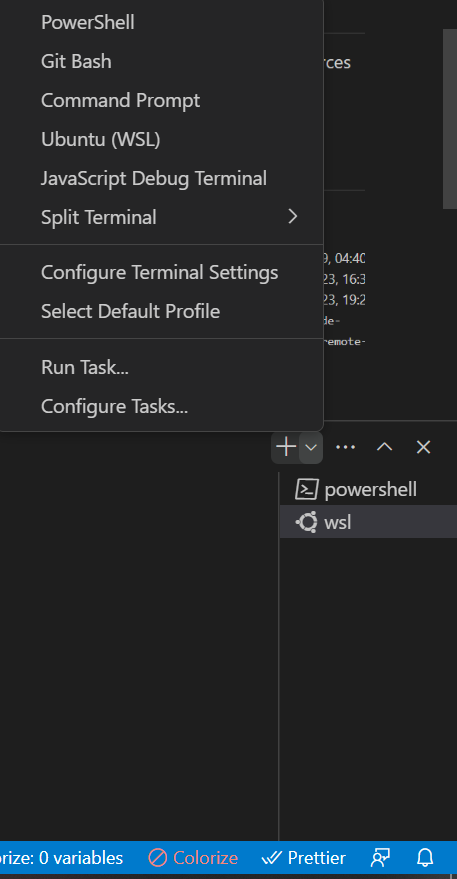

# Terminal App T1A3 - Lim Chiem
## R3 Provide full attribution to referenced sources (where applicable)

#### 
* Simon Dahal (coder academy)
* user input check against csv https://medium.com/@bryanJR/creating-a-user-database-with-csv-files-python-a7d3d33e5b48

## R4 Provide a link to your source control repository

### Here is the link to my repo https://github.com/Limchiem/T1A3-Assignment

## R5 Identify any code style guide or styling conventions that the application will adhere to.

#### PEP8 is the code styling that i am adhering to. By following this style there are several things to take note of:
* Indentation - 4 space per indentation level. 
    - As a programmer having proper indentation not only makes code more readable but some code might not function correctly due to poor indentation.
* Maximum line length - 79 characters
    - Limiting the amount of words that appears on a line makes it easier to read even if you can just scroll horizontally.
* Imports - should be done on separate lines as should be grouped accordingly
    - Standard library imports
    - Related third party imports
    - Local application/library specific imports
* Blank lines - top level function and classes are separated by two blank lines.

Source - https://peps.python.org/pep-0008/

## R6 Develop a list of features that will be included in the application.
#### My application is a atm app

Different features include:
* Adding users such with the following values: users, pin, balance uses `while`m `try` and `except` to make sure information entered is correct and `break` to exit the loop.
* Log in system which checks if user exist and verify the user and pin matches uses `for` and `if` loops to match against register user.
* Check balance allows you to check balance of the user logged in. uses `for` loop to check balance of current user.
* Withdraw function uses `if/else` to make sure there is enough balance in your account.
* Deposit uses `if/else` to check balance
* menu uses `if/else` for selecting options - withdraw, deposit, balance.

## R7

Link to board https://trello.com/invite/b/wRQQhDkX/ATTI35299694e1caa1c4b5dcf74c0f4d75c3BD9EDFE7/t1a3

## R8 Design help documentation which includes a set of instructions which accurately describe how to use and install the application.

#### ATM App installation guide:
 
Make sure you have a computer or laptop set up with a program such as visual studio code set up or any IDE(integrated development environment) so you may run this application. I would suggest Visual studio code because this was created using <a href="https://code.visualstudio.com/download">visual studio code</a> also download python from <a href="https://www.python.org/downloads"/>here</a>

 

Once you have visual studio code downloaded and installed go to https://github.com/Limchiem/T1A3-Assignment and click on `<a> code` and down zip. 

Extract the file using a software such as [winrar](https://www.win-rar.com/download.html?&L=0) and then open up visual studio code and click on `view` and click `extension` and search for `wsl` and install it if its not installed .

Next click `Terminal` and click `new terminal` when the terminal open below click on the + arrow and select wsl 

Now click `file` and to go `open folder` and open the folder you you unzipped. when prompted to trust me click trust me im trustworthy.

Now in the terminal assuming you opened the file called LimChiem_T1A3 type `cd ./src` in the terminal.

Once you've done that type `./run1.sh` to see if python is installed and then type `./run2.sh` and that should initialise the game.

# Link to presentation

https://youtu.be/lW55SrF9oTA